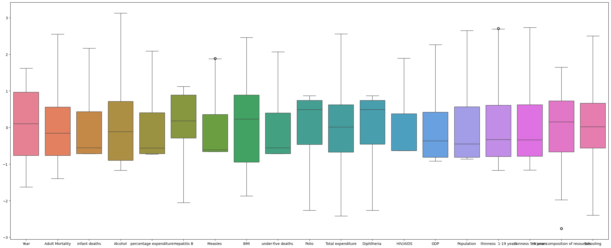
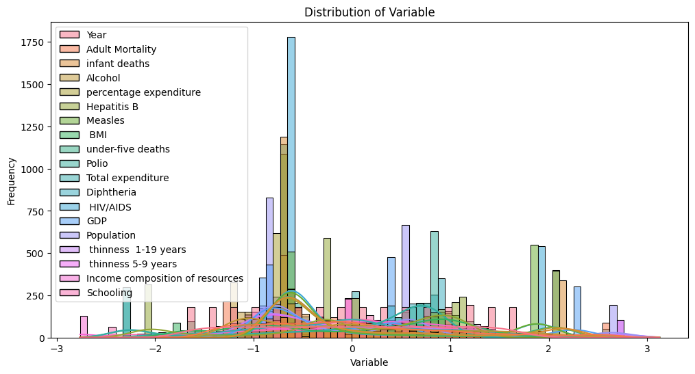
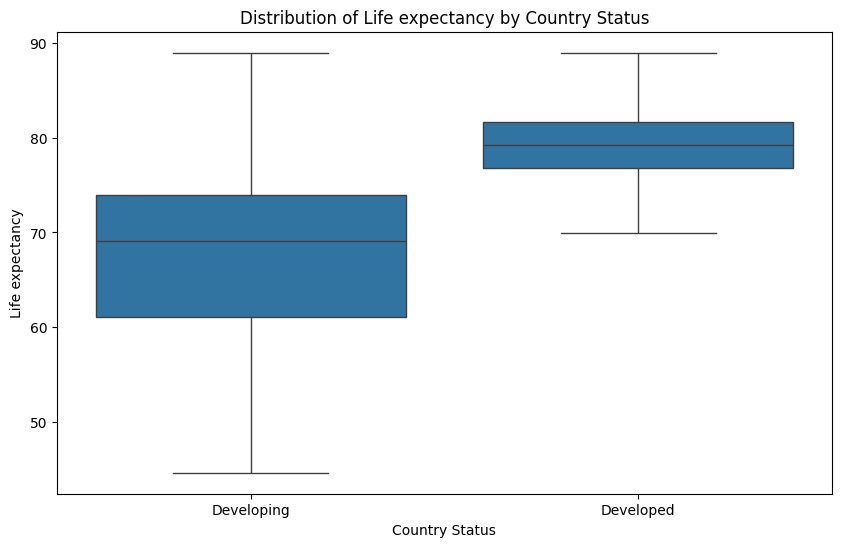
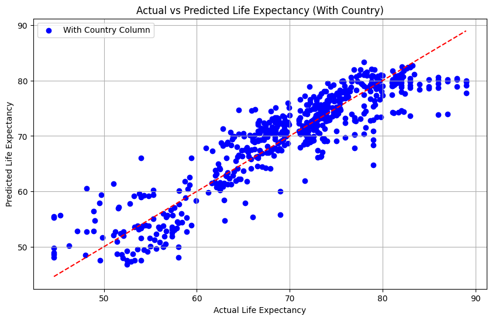
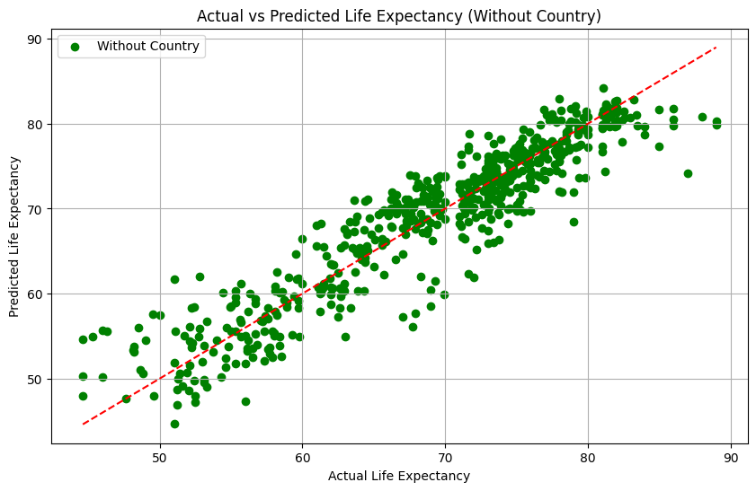

# Life Expectancy Analysis Using Regression and Statistical Testing

**Machine Learning **

---

## Abstract
This study analyzes life expectancy data provided by the World Health Organization (WHO) to understand the impact of socioeconomic and health indicators on life expectancy. We perform data preprocessing, statistical hypothesis testing, correlation analysis, and regression modeling to explore insights into country-level life expectancy outcomes. The analysis includes both models with and without country-specific information. The study concludes with insights into predictive modeling strategies for public health forecasting and discusses implications for global health policy.

## Introduction
Life expectancy is a fundamental metric used to measure the health and well-being of populations across countries. It is influenced by a multitude of factors including healthcare quality, disease prevalence, nutrition, education, and economic status. Understanding these influences can guide national and international organizations in crafting more effective health policies. In this project, we leverage the WHO life expectancy dataset to conduct in-depth exploratory and inferential analysis, culminating in the creation of predictive models.

## Data Description and Preprocessing
The dataset comprises records from 193 countries between 2000 and 2015. It includes 22 variables capturing economic indicators, healthcare statistics, immunization rates, and demographic data.

### Missing Values
- Median imputation was chosen for numerical variables to mitigate the impact of outliers.
- The `Status` column was label encoded: "Developed" = 1, "Developing" = 0.
- Rows with more than 30% missing values were dropped.

### Feature Engineering and Scaling
- Z-score normalization was applied to all numerical features.
- `Year` was treated as a categorical feature when necessary.
- Some health indicators were grouped into broader categories for hypothesis testing.

## Exploratory Data Analysis (EDA)

### Boxplot Distribution of Features

The wide spread in `BMI`, `Alcohol`, and `Measles` shows high variability across countries, reflecting differing health priorities.

### Distribution of Standardized Variables

Most features exhibit unimodal patterns; however, `GDP` and `Population` are right-skewed due to a few countries with extremely high values.

### Life Expectancy by Country Status

Developed countries enjoy higher life expectancy, as expected. The interquartile range is tighter, indicating more uniform health conditions.

## Statistical Hypothesis Testing

### Hepatitis B Vaccination by Country Status
- **Null Hypothesis (H0):** There is no difference in vaccination rates.
- **Alternative Hypothesis (H1):** Developed countries have higher coverage.

_Result:_ Significant at p < 0.05, suggesting socioeconomic disparity.

### Life Expectancy by Country Status
- **H0:** Mean life expectancy is equal.
- **H1:** Developed countries have higher expectancy.

_Result:_ Strong evidence (p < 0.01) supports H1.

### Life Expectancy by Year (ANOVA)
- **H0:** No variation across years.
- **H1:** At least one year differs.

_Result:_ p < 0.05; improvements over time are statistically significant.

### BMI vs Life Expectancy (Correlation)
- **H0:** No association.
- **H1:** Positive correlation exists.

_Result:_ r = 0.3 indicates moderate correlation.

### Schooling vs Life Expectancy
- **H0:** No association.
- **H1:** Higher education increases longevity.

_Result:_ Strong correlation r > 0.6 confirms importance of education.

## Correlation Analysis
We computed Pearson's correlation coefficients:

- **Highly Positive:** `Schooling`, `Income composition`, `BMI`, `Diphtheria`
- **Highly Negative:** `HIV/AIDS`, `Adult Mortality`, `Thinness 5-9 years`

These insights informed our feature selection in regression modeling.

## Regression Modeling

### Train-Test Split by Country
We avoided data leakage by ensuring countries in training did not appear in testing.

#### With Country Feature

The model fits training data well but lacks generalizability, indicating overfitting.

#### Without Country Feature

Performance slightly declines, but generalization improves. This model is better suited for new, unseen countries.

### Random vs Country-Based Splitting
Random splitting gives overly optimistic results due to repeated entities. Country-based splitting reflects real-world generalization challenges.

### Regularized vs Plain Regression
Lasso regression enhances interpretability:
- Drops irrelevant variables.
- Retains features aligned with correlation results (e.g., `Schooling`, `Income composition`).

This technique avoids multicollinearity and overfitting.

## Discussion
Our results confirm the value of statistical and machine learning methods in public health research. The statistical tests validated common beliefs about inequality in health outcomes. Regression modeling highlighted features with high predictive power, confirming the role of education, income, and preventive healthcare.

Including the `Country` feature yielded more accurate training predictions but led to overfitting. A robust model must prioritize generalization — particularly when predicting for countries with no historical data.

## Conclusion
This analysis shows that life expectancy is multifactorial and impacted by healthcare infrastructure, education, and social determinants. Country-specific information should be cautiously used in modeling to avoid overfitting. Lasso regression not only maintains predictive performance but also simplifies model interpretation. Future work can explore ensemble models and time-series forecasting of national health metrics.

## References
- [WHO Life Expectancy Dataset](https://www.kaggle.com/datasets/kumarajarshi/life-expectancy-who)
- [Scikit-Learn Documentation](https://scikit-learn.org)
- [Data-to-Viz Guide](https://www.data-to-viz.com)
- WHO Global Health Observatory Data Repository
- James, G., Witten, D., Hastie, T., Tibshirani, R. (2021). *An Introduction to Statistical Learning*. Springer.
